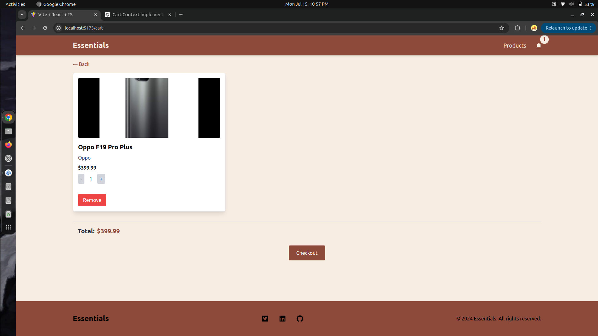
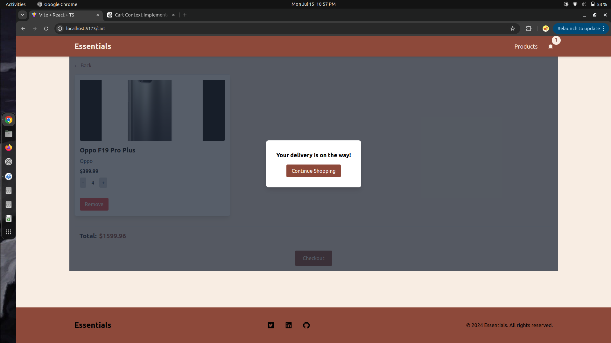

# Essentials E-Commerce Platform

Essentials is a modern e-commerce platform built with React and TypeScript, using Tailwind CSS for styling. This project includes features such as product listing, product details, shopping cart, and checkout functionality.

## Table of Contents

- [Essentials E-Commerce Platform](#essentials-e-commerce-platform)
  - [Table of Contents](#table-of-contents)
  - [Installation](#installation)
  - [Usage](#usage)
  - [Features](#features)
  - [Folder Structure](#folder-structure)
  - [Screen Shots](#screen-shots)

## Installation

To get started with Essentials, follow these steps:

1. **Clone the repository:**

   ```bash
   git clone https://github.com/debrajroyofficial000/Essentials.git
   cd Essentials
   ```

2. **Install dependencies:**

   ```bash
   npm install
   ```

3. **Start the development server:**

   ```bash
   npm run dev
   ```

4. Open your browser and navigate to `http://localhost:5173` to view the application.

## Usage

Essentials provides a seamless shopping experience with the following main features:

1. **Product Listing:** Browse through a list of available products.
2. **Product Details:** View detailed information about each product, including images, description, price, and reviews.
3. **Shopping Cart:** Add products to your cart, update quantities, and remove items.
4. **Checkout:** Complete your purchase with a simple checkout process.

## Features

- **React and TypeScript:** Robust and type-safe codebase.
- **Tailwind CSS:** Modern and utility-first CSS framework for rapid UI development.
- **Responsive Design:** Mobile-friendly and adaptable layouts.
- **Context API:** State management using React Context for products and cart.
- **React Router:** Seamless navigation between different pages.

## Folder Structure

```
essentials/
├── public/
│   ├── index.html
│   └── ...
├── src/
│   ├── assets/
│   ├── components/
│   │   ├── Cart.tsx
│   │   ├── Product.tsx
│   │   └── ...
│   ├── context/
│   │   ├── CartContext.tsx
│   │   ├── ProductContext.tsx
│   │   └── ...
│   ├── pages/
│   │   ├── Home.tsx
│   │   ├── ProductDetail.tsx
│   │   └── ...
│   ├── styles/
│   │   └── tailwind.css
│   ├── utils/
│   │   └── lib.ts
│   ├── App.tsx
│   ├── index.tsx
│   └── ...
├── tailwind.config.js
├── package.json
├── tsconfig.json
└── ...
```

## Screen Shots





